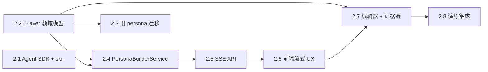

# Epic 2: Persona Builder — 从素材一键生成 5-layer 对手画像

## 概述

**背景**: 开练前手动填角色卡是启动摩擦的头号杀手。用户早上被老板突然叫去时没心情填表，导致产品日活拉不上来。

**价值**: 粘贴一段真实素材（聊天记录/邮件/会议纪要文本）→ 3 分钟内获得一个有压迫感、可追溯证据、可校对的对手 Persona，直接进入演练。

**范围**:
- 后端集成 Claude Agent SDK + fork colleague-skill 本地运行
- 多租户 workspace 隔离
- 对 skill 输出做"对抗化后处理"（注入压迫感/隐藏议程/打断倾向）
- 5-layer Persona 结构化（Hard rules / Identity / Expression / Decision / Interpersonal）
- 每条特征带原文证据引用（evidence chain）
- 前端粘贴入口 + 流式可视化 agent 工作过程（Claude Code 风格）
- 生成后进入 Persona 编辑器校对
- 现有 markdown personas 迁移到新 5-layer 结构

**不含**（Phase 3+ 再做）:
- 文件上传（.txt / .eml / JSON）、截图 OCR、语音转写
- 双模式（快速 vs 深度）切换
- Agent 主动追问 / 对话式建模深化
- 镜像挑战（反向画用户）
- 演练后持续演化（用户反馈回流改进 persona）

## Story 列表

### Story 2.1: Claude Agent SDK 基础设施 + skill fork + workspace 隔离

**用户故事**: 作为开发者，我需要在后端引入 Claude Agent SDK 并 fork colleague-skill，提供多租户隔离的 workspace 管理，以便后续 Story 可以让 sub-agent 安全地跑 skill 完成建模任务。

#### 验收标准
- [ ] `backend/pyproject.toml` 引入 `claude-agent-sdk>=0.1.0` 并 `uv sync` 成功 `验证: pytest import claude_agent_sdk → no error`
- [ ] `backend/.claude/skills/colleague-skill/` 存在 fork 自 titanwings/colleague-skill 的完整 skill，含 SKILL.md 与 prompts/ `验证: pytest 文件存在且 SKILL.md 含 YAML frontmatter`
- [ ] 新增 `backend/infrastructure/external/agent_sdk/client.py` 提供 `AgentSkillClient.build_persona(workspace, materials) -> AsyncIterator[AgentEvent]` `验证: pytest mock SDK → 返回 AsyncIterator`
- [ ] 多租户 workspace：每次调用在 `/tmp/daboss/workspaces/{user_id}/{session_id}/` 创建独立 cwd，设置 `setting_sources=["project"]` `验证: pytest 并发 2 用户调用 → 2 个独立目录，无文件串扰`
- [ ] Workspace 在任务完成/失败 5 分钟后由后台任务清理 `验证: pytest mock time + 调度 → 清理任务被触发`
- [ ] `ANTHROPIC_API_KEY` 通过 `core.config.settings` 注入，缺失时启动即报 ConfigError `验证: pytest 缺 key → raise ConfigError`
- [ ] Sub-agent 超时 180 秒，超时抛 `AgentTimeoutError` `验证: pytest mock 长任务 → raise AgentTimeoutError`
- [ ] Agent stream 事件封装为 `AgentEvent(type, payload, ts, seq)` 结构 `验证: pytest 事件对象字段完整`

**参考**: docs/plans/2026-04-13-2.1-agent-sdk-skill-foundation.md
**依赖**: 无

---

### Story 2.2: 5-layer Persona 领域模型 + DB 迁移

**用户故事**: 作为开发者，我需要扩展 Persona 领域模型到 5-layer 结构并新增 evidence 字段，以便结构化地持久化生成的画像和原文引用。

#### 验收标准
- [ ] `domain/stakeholder/entity.py` 新增 5-layer 子类型：`HardRule`, `IdentityProfile`, `ExpressionStyle`, `DecisionPattern`, `InterpersonalStyle` `验证: pytest dataclass 实例化 → 字段类型正确`
- [ ] `Persona` 新增字段 `hard_rules: list[HardRule]`, `identity: IdentityProfile`, `expression: ExpressionStyle`, `decision: DecisionPattern`, `interpersonal: InterpersonalStyle`, `evidence_citations: list[Evidence]`, `schema_version: int`, `legacy_content: Optional[str]` `验证: pytest Persona v2 实例化 → 字段存在`
- [ ] `Evidence` dataclass 含 `claim: str, citations: list[str], confidence: float, source_material_id: str, layer: str` `验证: pytest Evidence(...) → 字段完整且 layer ∈ {hard_rules, identity, expression, decision, interpersonal}`
- [ ] alembic 迁移为 `stakeholder_personas` 表新增 `structured_profile JSONB`, `evidence_citations JSONB`, `schema_version INT DEFAULT 1`, `source_materials TEXT[]`, `legacy_content TEXT` `验证: DB alembic upgrade head → 所有列存在`
- [ ] 旧 persona 向后兼容：`schema_version=1` 读取时走 markdown parser（legacy），`=2` 走 JSON 字段 `验证: pytest v1 persona → full_content 非空; v2 persona → structured_profile 非空`
- [ ] `StakeholderRepository` 新增 `save_structured_persona(persona)` 与 `get_with_evidence(id) -> tuple[Persona, list[Evidence]]` `验证: pytest save 后 get → 证据链数量一致`
- [ ] `PersonaLoader` 在 schema_version=2 时跳过 markdown 扫描，走 DB `验证: pytest v2-only DB → loader 返回结构化 persona`

**参考**: docs/epics/epic-2-persona-builder.md §对抗化 + 证据链
**依赖**: 无

---

### Story 2.3: 旧 markdown persona 迁移到 5-layer

**用户故事**: 作为开发者，我需要把 `data/personas/*.md` 和 DB 中 schema_version=1 的 persona 迁移到 5-layer 结构，以便统一新旧 persona 的使用路径。

#### 验收标准
- [ ] `backend/scripts/migrate_personas_to_v2.py` 存在，幂等（schema_version=2 跳过） `验证: pytest 重跑脚本 → skip 已迁移项，返回 skipped_count`
- [ ] 扫描 `data/personas/*.md` + DB 中所有 `schema_version=1` persona，调 LLM 把 markdown 解析成 5-layer JSON `验证: pytest mock LLM → 5 个预置 persona（boss/cfo/cto/pm/teamlead）全部迁移成功`
- [ ] 原 markdown 保留在 `legacy_content` 字段，`full_content` 保持不变以保证向后兼容 `验证: DB 迁移后 legacy_content == 原 markdown 内容`
- [ ] 迁移失败的 persona 不阻塞其他：保持 `schema_version=1` + 记录 `migration_error` 字段（不新增列，写 JSON 到 `structured_profile._error`） `验证: pytest 模拟 1 个 persona LLM 失败 → 其他 4 个仍成功，失败项 schema_version 仍为 1`
- [ ] 提供 `--dry-run` 选项，只打印将要变更不写 DB `验证: CLI --dry-run → DB 无变更，stdout 含 diff 摘要`
- [ ] 迁移完成后输出汇总报告（成功/失败/跳过数） `验证: CLI 执行完 → stdout 含 "Migrated: N, Failed: M, Skipped: K"`

**参考**: data/personas/TEMPLATE.md, Story 2.2
**依赖**: Story 2.2

---

### Story 2.4: PersonaBuilderService — 编排 + 对抗化后处理

**用户故事**: 作为开发者，我需要一个 PersonaBuilderService 编排 agent + skill + 对抗化 + 结构化 + 持久化全流程，并以流式事件对外暴露进度，以便 API 层和前端可以按 Claude Code 风格渲染建模过程。

#### 验收标准
- [ ] `application/services/stakeholder/persona_builder_service.py` 提供 `async def build(user_id, materials) -> AsyncIterator[BuildEvent]` `验证: pytest mock 内部依赖 → yield 事件序列有序`
- [ ] 编排 6 阶段事件依次出现：`workspace_ready → agent_running(含 tool_use 子流) → parse_done → adversarialize_start → adversarialize_done → persist_done` `验证: pytest 断言事件类型序列`
- [ ] 对抗化 prompt 存于 `backend/application/services/stakeholder/prompts/adversarialize.md`，含"注入压迫感 / 暴露隐藏议程触发器 / 打断倾向 / 情绪状态机" 4 个规则段 `验证: pytest prompt 文件存在且含 4 个规则关键词`
- [ ] 对抗化 LLM 输出 JSON schema 校验失败时降级：保留基础 persona，标 `hostile_applied=False`，写入 `structured_profile._warnings` `验证: pytest mock 坏 JSON → persist 成功 + hostile_applied=False`
- [ ] 每条 5-layer 特征都关联至少 1 条证据（source = skill 输出引用 + 对抗化注入引用） `验证: pytest build → 所有 claims 的 citations 长度 ≥1`
- [ ] 整体超时 240 秒（agent 180s + 对抗化 60s），超时抛 `BuildTimeoutError` 并发出 error 事件 `验证: pytest mock 超时 → error 事件 + raise`
- [ ] 幂等缓存：`hash(user_id + materials)` 15 分钟内重复请求直接从 Redis/内存缓存返回上次结果 `验证: pytest 两次相同输入 → 第二次不调 LLM`
- [ ] 失败时 workspace 仍然被清理（通过 try/finally 保证） `验证: pytest mock 异常 → workspace 清理被调用`

**参考**: Story 2.1, Story 2.2
**依赖**: Story 2.1, Story 2.2

---

### Story 2.5: POST /persona/build SSE API

**用户故事**: 作为前端，我需要一个 SSE 流式接口提交素材并实时获得建模过程事件，以便渲染 Claude Code 风格的进度面板。

#### 验收标准
- [ ] `POST /api/v1/stakeholder/persona/build` 接收 `{ materials: string[], target_persona_id?: string, name?: string, role?: string }` 返回 SSE stream `验证: API 提交 → 200 + Content-Type: text/event-stream`
- [ ] SSE 事件类型覆盖：`workspace_ready | agent_tool_use | agent_message | parse_done | adversarialize_start | adversarialize_done | persist_done | heartbeat | error` `验证: API 完整跑一次 → 事件类型覆盖（除 error）`
- [ ] 每个事件结构 `{ seq, type, ts, data }`，seq 从 0 递增 `验证: pytest 流解析 → seq 严格递增 且无重复`
- [ ] 每 30 秒发一次 `heartbeat` 事件防止代理断连 `验证: pytest mock 60s 空闲 → 至少 1 条 heartbeat`
- [ ] 认证：复用 `Depends(get_current_user)`，无 token 返回 401 `验证: API 无 token → 401`
- [ ] materials 总长度 > 200k token 拒绝，返回 413 + 错误码 `MATERIAL_TOO_LARGE` `验证: API 超长文本 → 413 + code=MATERIAL_TOO_LARGE`
- [ ] materials 为空或只含空字符串拒绝，返回 400 + `MATERIAL_EMPTY` `验证: API [] → 400`
- [ ] 错误时推 `error` 事件（含 error_code + message）后正常关闭流 `验证: pytest mock 内部异常 → 1 条 error 事件 + 流正常 close`
- [ ] 客户端断开连接时后台任务尝试继续完成并结果入库（不阻塞也不丢弃） `验证: pytest mock client disconnect → service 仍完成 persist`

**参考**: Story 2.4
**依赖**: Story 2.4

---

### Story 2.6: 前端粘贴入口 + Claude Code 风格流式进度渲染

**用户故事**: 作为用户，我希望在 Settings 看到"从素材生成对手"入口，粘贴我的素材后能像看 Claude Code 一样实时看到分析过程，以便我对建模结果产生信任。

#### 验收标准
- [ ] Settings 页新增 "从素材生成对手" 按钮，点击跳转 `/persona/new` 新页面 `验证: Browser .settings button.persona-build-btn → exists`
- [ ] `/persona/new` 页面左侧为素材输入区，右侧为进度流面板 `验证: Browser .persona-builder .input-pane, .persona-builder .progress-pane → both exist`
- [ ] 多段文本输入：初始 1 段 textarea，"+ 添加素材"最多加到 5 段，每段可选类型 tag（聊天/邮件/纪要/其他） `验证: Browser 点 + 4 次 → 5 段 textarea；再点 → 按钮 disabled`
- [ ] 可填角色名称和职位（可选），为空则用 agent 提炼的默认值 `验证: Browser 留空名称 → 完成后名称非空`
- [ ] 点击 "开始分析" → 建立 SSE 连接并渲染进度流 `验证: Browser 点击 → .progress-pane 出现 .event-row`
- [ ] 每个 agent_tool_use 事件渲染为 `✓ 解析 {n} 条消息` / `⋯ 分析决策模式中...` 样式，区分已完成/进行中 `验证: Browser 进行中事件 → .event-row.in-progress; 已完成 → .event-row.done`
- [ ] 失败时 toast 提示 + 右下角 "重试" 按钮（保留输入） `验证: Browser 模拟 error 事件 → toast 可见 + button.retry exists`
- [ ] 完成后 2 秒自动跳转 `/persona/:id/edit`，也可手动点"查看结果" `验证: Browser done 事件 → URL 在 2s 内变为 /persona/:id/edit`
- [ ] 分析过程中切换路由弹确认框（避免用户不小心离开） `验证: Browser 进行中点其他路由 → 弹 ConfirmDialog`
- [ ] 视觉风格对齐 Variant B 设计基线（详见 `docs/designs/epic-2-persona-builder/DESIGN.md` §4）：素材输入卡片圆角 12px + 类型 tag 配色（聊天=绿/邮件=紫/纪要=琥珀/其他=灰）；进度事件 pill 化（✓ 绿背景 / ⋯ 脉冲 / ❌ rose 背景）；空态用 hero card 占位 + ✨ emoji `验证: Browser .input-segment 圆角=12px 且 .progress-event 类与状态对应`

**参考**: Story 2.5, [`DESIGN.md`](../designs/epic-2-persona-builder/DESIGN.md) §4
**依赖**: Story 2.5

---

### Story 2.7: 5-layer Persona 编辑器 + 证据链展开

**用户故事**: 作为用户，我希望在编辑器里看到 5-layer 结构化画像，每条特征都能点开看原文引用，并能随时修改或标记"不对"，以便我确认 AI 没有胡编乱造。

**设计基线**: [`docs/designs/epic-2-persona-builder/DESIGN.md`](../designs/epic-2-persona-builder/DESIGN.md) — 已锁定 Variant B（DaBoss 原生游戏风），参考实现 [`variant-b-daboss.html`](../designs/epic-2-persona-builder/variant-b-daboss.html)

#### 功能验收标准
- [ ] `/persona/:id/edit` 页面包含 5 个 layer 卡片：Hard Rules / Identity / Expression / Decision / Interpersonal，默认全展开 `验证: Browser .persona-editor .layer-card → count=5`
- [ ] 每条特征是一个 row，右侧有 `[查证据]` icon 按钮 `验证: Browser .feature-row .evidence-btn → 每行均 exist`
- [ ] 点击 `[查证据]` → popover 展示该特征对应的 citations 原文片段 + 置信度 + 来源素材 id `验证: Browser 点击 → .evidence-popover 可见 + 含至少 1 条原文`
- [ ] 每条特征可双击行内编辑文本；修改后 section 出现 "未保存" 标记 `验证: Browser 双击编辑 → .layer-header .unsaved-badge exists`
- [ ] 每条特征右上有 `[❌不对]` 按钮，点击后该特征标灰 + 加 `user_rejected=true` 标记（不删除，用于后续回流） `验证: Browser 点击 → .feature-row.rejected class 出现`
- [ ] 置信度 <0.6 的特征显示警示条 + 黄色 chip "⚠ 证据不足"，chip 带 2.4s pulse 动画 `验证: Browser 低置信度 row → .feature-row.warn 含 .warn-chip 且有 animation 属性`
- [ ] "保存" 按钮调用 `PATCH /api/v1/stakeholder/persona/:id` 更新结构化字段 `验证: API PATCH → DB 结构化字段更新成功`
- [ ] 未保存变更离开页面弹 ConfirmDialog `验证: Browser 有未保存修改时切换路由 → ConfirmDialog 弹出`

#### 设计验收标准（对齐 Variant B）
- [ ] **Hero Card**：顶部 ~120px 圆角 20px 卡片，含 80px 圆形头像（带 conic-gradient 外环 + 右下 pulse dot）+ 名字 24px bold + 副标题 + Persona Strength % 进度条（基于所有特征 confidence 加权平均） `验证: Browser .persona-hero .avatar-big 含 .ring 且 .strength .fill 宽度对应 confidence 平均`
- [ ] **5 个 layer card**：每个 layer 顶部有 40px 圆形 emoji 图标圈，按规约配色：Hard Rules=rose / Identity=violet / Expression=mint / Decision=amber / Interpersonal=mint `验证: Browser .layer-icon 类与 layer 类型一一对应`
- [ ] **Feature row**：圆角 12px pill 卡片，左侧 emoji 前缀（⚖️🎯🗣️🧠🤝），hover 时 translateY(-1px) + 升级阴影 `验证: Browser hover feature-row → 检测到 transform 变化`
- [ ] **Evidence Popover**：320px 宽 + 圆角 16px + shadow-lg + 左侧三角箭头；置信度用 80×80 SVG 圆环 gauge（不是 bar），中央显示 0.XX 数字 + "置信度" label `验证: Browser .evidence-popover .gauge svg circle → exists 且 stroke-dasharray 与 confidence 比例对应`
- [ ] **Citation 卡**：popover 内每条引用含 24×24 来源图标（💬/✉️/📝）+ 时间戳 + 来源 tag + 斜体引用文字 `验证: Browser .pop-cite count ≥1 且包含 .cite-icon, .cite-time, .cite-text`
- [ ] **Floating CTA Bar**：底部固定居中，圆角 20px + shadow-lg，主按钮 "🚀 开始演练" 用 primary-gradient + 绿色发光阴影，次按钮 "💾 保存备用" ghost 风格 `验证: Browser .cta position=fixed bottom=24px 含 .btn-go 与 .btn-ghost`
- [ ] **背景装饰**：右上 + 左下两处径向渐变 orb（绿色 + 紫色），pointer-events: none `验证: Browser body::before 与 body::after 计算样式 background 含 radial-gradient`
- [ ] **响应式断点**：1440 / 1024 / 768 三档无破版；popover 在 < 1180px 改为底部 bottom-sheet（复用 ConfirmDialog 容器） `验证: Browser viewport 1180 → .popover 不可见，.evidence-sheet 可见`

**参考**: Story 2.2, Story 2.6, [`DESIGN.md`](../designs/epic-2-persona-builder/DESIGN.md), [`variant-b-daboss.html`](../designs/epic-2-persona-builder/variant-b-daboss.html)
**依赖**: Story 2.2, Story 2.6

---

### Story 2.8: 演练集成（对接 battle_prep / chatroom）

**用户故事**: 作为用户，我希望点"开始演练" 就能直接进入聊天室和这个生成的对手对话，不需要再手动建房间填信息。

#### 验收标准
- [ ] "开始演练" 按钮调用 `battle_prep_service.create_room_from_persona(persona_id, user_id)` 创建 chatroom `验证: API 点击 → 返回 room_id + DB 新 room 关联该 persona`
- [ ] 成功后跳转 `/chat/:roomId` 并以该 persona 作为对手 `验证: Browser 点击 → URL 变更 + chat 首屏显示该 persona 名称`
- [ ] `prompt_builder` 新增 `build_system_prompt_v2(persona: Persona)` 方法，按 5 层有序展开为 system prompt `验证: pytest v2 persona → system_prompt 依次包含 Hard Rules / Identity / Expression / Decision / Interpersonal 段`
- [ ] 对抗化字段（hostile rules / hidden agenda）注入 system prompt 且标记为"不轻易暴露" `验证: pytest v2 persona with hostile → prompt 含 "你有隐藏议程" 类指令`
- [ ] `stakeholder_chat_service` 在加载 persona 时根据 `schema_version` 选择 v1 (legacy markdown) 或 v2 (5-layer) prompt 构造路径 `验证: pytest 混合两版 persona → 各走各的路径不串`
- [ ] 集成测试：用 2.6+2.7 生成的 persona 进入 chat → 首轮 AI 回复包含 Expression 层的某个口头禅关键词 `验证: pytest e2e → AI 首轮回复文本匹配 persona.expression.catchphrases 中至少 1 条`

**参考**: Story 2.2, Story 2.7, 现有 `backend/application/services/stakeholder/battle_prep_service.py`
**依赖**: Story 2.7

---

## 依赖关系

**Epic 依赖**: 无（与 Epic 1 Growth Dashboard 并行可行）
**技术依赖**:
- `claude-agent-sdk` Python 包（新引入）
- Anthropic API key（已有）
- Alembic migration（已有基础设施）
- SSE（`fastapi.responses.StreamingResponse`，项目已使用）

## 风险矩阵

| 风险 | 概率 | 影响 | 应对 |
|------|------|------|------|
| Claude Agent SDK 在 FastAPI async 上下文阻塞事件循环 | 中 | 高 | Story 2.1 优先做可行性 spike，必要时用 anyio.to_thread 隔离 |
| colleague-skill markdown 输出格式变动导致解析失败 | 中 | 中 | fork 进 repo 锁定版本，不走 submodule |
| 对抗化后 persona 过于攻击性导致用户不适 | 中 | 中 | 对抗化强度预留 3 档配置（弱/中/强），MVP 默认中档 |
| 旧 persona 迁移 LLM 解析失败批量损坏 | 低 | 高 | Story 2.3 保留 legacy_content + --dry-run + 失败不阻塞 |
| SSE 长连接在 nginx/cloudflare 代理下断连 | 中 | 中 | Story 2.5 每 30s 心跳 + client 断连后端继续完成 |
| 单次 agent 调用成本 $0.5-$2，被恶意用户刷 | 中 | 高 | Story 2.5 幂等 key 缓存 + 建议 Story 2.1+ 加用户级速率限制（每日 N 次） |
| 多租户 workspace 泄漏别人的素材文件 | 低 | 严重 | Story 2.1 强制按 user_id + session_id 隔离 cwd，5 分钟清理 |

## 参考文档

- 本 Epic 核心 Story 执行计划: [docs/plans/2026-04-13-2.1-agent-sdk-skill-foundation.md](../plans/2026-04-13-2.1-agent-sdk-skill-foundation.md)
- 现有 Persona 实现: `backend/application/services/stakeholder/persona_loader.py`
- 现有 Persona 模板: `data/personas/TEMPLATE.md`
- 现有 Battle Prep: `backend/application/services/stakeholder/battle_prep_service.py`
- Fork 参考: [titanwings/colleague-skill](https://github.com/titanwings/colleague-skill)
- Claude Agent SDK: [anthropics/claude-agent-sdk-python](https://github.com/anthropics/claude-agent-sdk-python)
