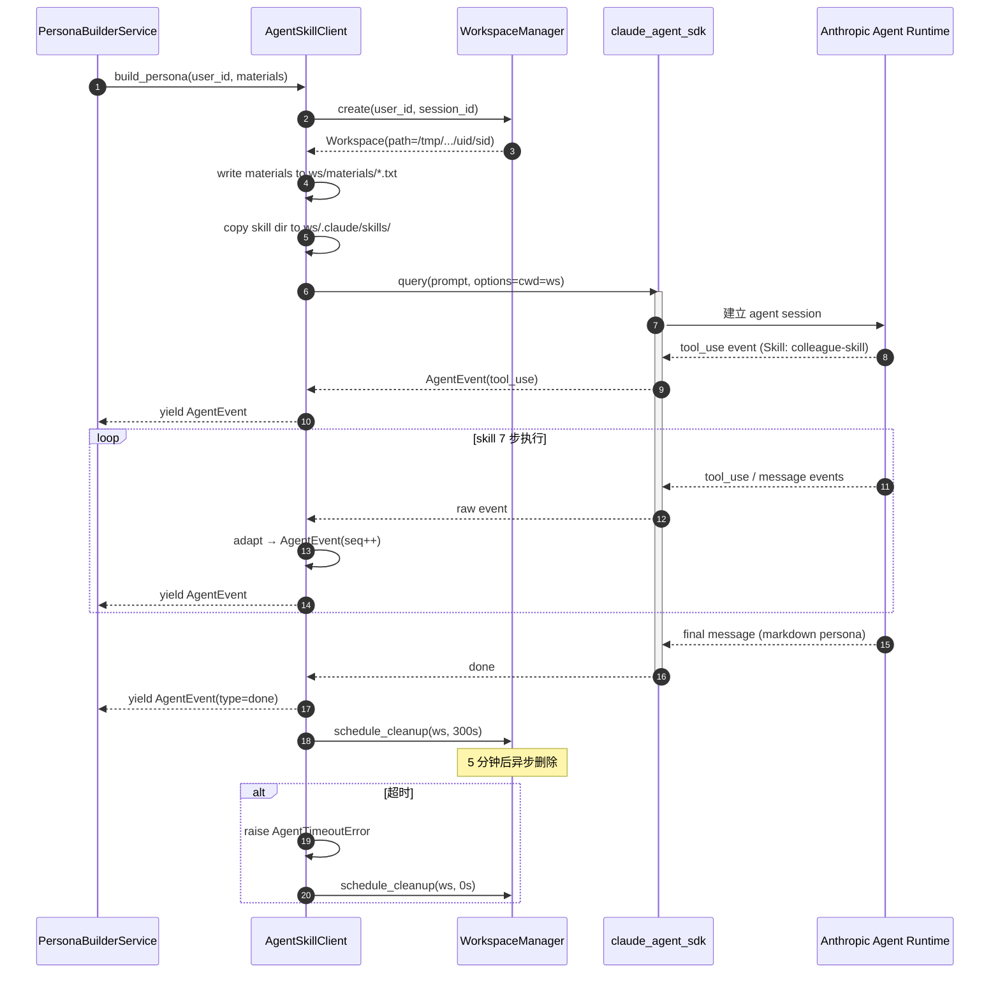

# Story 2.1 执行计划 — Claude Agent SDK 基础设施 + skill fork + workspace 隔离

**Story**: Epic 2 / Story 2.1
**日期**: 2026-04-13
**Owner**: wanhua.gu
**依赖**: 无
**阻塞**: Story 2.4, 2.5 (整个 Epic 2 的后端链路)

## Context

本 Story 是 Epic 2 的技术基石。引入 Claude Agent SDK 让后端能够在 FastAPI 进程内起一个子 agent，加载 fork 自 `titanwings/colleague-skill` 的本地 skill，完成从素材到 markdown persona 的 7 步 pipeline。

核心挑战有三：
1. **新依赖引入**：`claude-agent-sdk` 在 FastAPI async 上下文中的行为未经验证（SDK 内部有无阻塞调用、事件循环兼容性）
2. **多租户隔离**：skill 默认读写 `.claude/skills/` 和 cwd，多用户并发时必须隔离 workspace 防串号
3. **生命周期管理**：agent 进程的超时、取消、workspace 清理、错误传播

---

## §0 Triage 分级

| # | 问题 | 答案 |
|---|------|------|
| 1 | 单一用户目标？ | YES（开发者可编程调用 agent skill） |
| 2 | 单一业务模块？ | YES（infrastructure/external/agent_sdk）|
| 3 | 不改 DB schema？ | YES（Story 2.1 不动 DB）|
| 4 | 不改公共 API？ | YES（只加内部抽象，API 在 2.5）|
| 5 | 不改 domain 规则？ | YES（Story 2.1 不动 domain）|
| 6 | 不涉及外部系统？ | **NO** — 引入 claude-agent-sdk + Anthropic Agent runtime |
| 7 | 不涉及权限安全？ | **NO** — 多租户 workspace 隔离 + API key 保护 + sub-agent 可执行 Bash 的沙箱风险 |
| 8 | 少量文件？ | **NO** — ~10+ 文件（客户端封装、workspace manager、config、settings、测试、skill 目录 fork） |

**→ Flow C**（3 个 NO + 强制升级条件：引入外部系统 + 安全边界）

**Flow C 要求填写第 1 + 2 + 3 层 + §11 执行步骤。**

---

## 第 1 层：范围与风险

### 目标

1. 后端能在 FastAPI 进程内 async 调用 Claude Agent SDK，并加载 `backend/.claude/skills/colleague-skill/`
2. 提供 `AgentSkillClient.build_persona(user_id, materials)` 抽象，返回 `AsyncIterator[AgentEvent]`
3. 每次调用创建独立 workspace（`/tmp/daboss/workspaces/{user_id}/{session_id}/`），任务结束后 5 分钟清理
4. 提供超时保护（180s）和错误隔离
5. 后续 Story (2.4) 只依赖 `AgentSkillClient` 抽象，不直接操作 SDK

### 范围

**做**:
- 新增依赖 `claude-agent-sdk>=0.1.0`
- Fork colleague-skill 到 `backend/.claude/skills/colleague-skill/`（git clone 后去掉 .git，锁定一个 commit）
- 新增 `backend/infrastructure/external/agent_sdk/` 模块：
  - `client.py` — `AgentSkillClient` 主类
  - `events.py` — `AgentEvent` 事件定义 + SDK 事件适配
  - `workspace.py` — `WorkspaceManager` 多租户目录管理
  - `exceptions.py` — `AgentTimeoutError`, `AgentRunError`, `WorkspaceError`
  - `README.md` — 文件夹索引
- 新增配置 `core/config.py::AgentSDKSettings`（API key、超时、workspace root）
- 在 `main.py` lifespan 启动时初始化，关闭时清理活跃 workspace
- 后台清理任务（APScheduler 或 asyncio 周期任务）
- 单元测试 + 一个集成测试（mock Anthropic）

**不做（明确 Not-in-scope）**:
- 实际调用 colleague-skill 完整 7 步 pipeline（Story 2.4 的事）
- 对抗化后处理（Story 2.4）
- 5-layer 结构化（Story 2.2）
- SSE API route（Story 2.5）
- 用户级速率限制（建议 Epic 后期加，不在 2.1）

### 验收标准（拷贝自 Epic，此处为执行依据）

见 Epic 2 Story 2.1 AC，共 8 条。

### 影响范围

| 层 | 变更 |
|---|---|
| infrastructure/external/agent_sdk/ | 新增（client / events / workspace / exceptions） |
| core/config.py | 新增 `AgentSDKSettings` |
| main.py | lifespan 集成 |
| pyproject.toml | 依赖 + uv.lock |
| backend/.claude/skills/colleague-skill/ | fork 目录 |
| tests/ | test_agent_skill_client.py, test_workspace_manager.py |

### 风险

| 风险 | 等级 | 应对 |
|---|---|---|
| claude-agent-sdk 内部阻塞事件循环 | 高 | Pre-flight spike：写 20 行脚本验证 async for 是否流畅，必要时用 `anyio.to_thread.run_sync` 包裹 |
| Sub-agent 启动子进程污染 FastAPI 内存（skill 默认允许 Bash/Write） | 高 | 配置 `allowed_tools=["Skill", "Read", "Write", "Grep", "Glob"]` 不开 Bash；workspace cwd 限定 |
| workspace 目录清理失败累积占用磁盘 | 中 | 清理任务失败有监控日志 + 定期扫描兜底（7 天未访问的目录强删） |
| API key 泄漏到日志 | 高 | settings 字段用 `SecretStr`；log 中脱敏 |
| 并发请求耗尽 Anthropic rate limit | 中 | Story 2.1 内加简单 semaphore（默认 5 并发），具体限流策略留给 Story 2.5 |
| colleague-skill 内部依赖未知工具（如飞书 API） | 中 | fork 后审查 SKILL.md 的 allowed_tools；只保留 MVP 需要的（纯文本处理） |

### 完成标准

所有 8 条 AC 通过，且：
- [ ] 一次手动 smoke test：构造 10 条假聊天记录，实际调通一次 agent 返回 markdown
- [ ] 代码走查无 API key 硬编码
- [ ] Workspace 隔离能通过并发压测（2 个用户同时跑，文件互不可见）

---

## 第 2 层：术语、现状、方案、流程

### §6 术语

| 术语 | 定义 |
|---|---|
| **Agent SDK** | `claude-agent-sdk` Python 包，用于在进程内起 Claude Code 风格的 sub-agent |
| **Skill** | AgentSkills 开放标准下的能力包，目录形式，含 SKILL.md + prompts/ + 可选 scripts/ |
| **Workspace** | 单次 agent 调用的工作目录，隔离素材文件和 agent 产出 |
| **Setting Sources** | SDK 配置项 `setting_sources=["project"]` 让 SDK 从 cwd 的 `.claude/` 加载 skill 和设置 |
| **Tool Use Stream** | Sub-agent 执行过程中发出的 `tool_use` 事件流，类似 Claude Code 的 todo 列表 |
| **AgentEvent** | 本项目对 SDK 原始事件的统一封装，包含 `type/payload/ts/seq` |
| **Pre-flight Spike** | 一个小脚本在正式集成前验证未知技术假设 |

### §7 当前现状

**后端 LLM 调用现状**：
- `backend/infrastructure/external/llm/anthropic_provider.py` 使用 `AsyncAnthropic` 客户端
- 通过 `LLMPort` 抽象对外暴露，application 层只依赖 port
- 调用方式是单次 messages.create，不含 tool use / agent 能力

**Skill 相关**：
- 项目已有 `.claude/skills/`（在 repo 根，不在 backend），但那是给 Claude Code 用的开发者 skill
- `backend/` 下没有任何 `.claude/` 目录，需要新建

**多租户**：
- 项目已有 `api/dependencies.py::get_current_user`
- 用户标识为 `user_id: str`
- 当前 API 已按 user_id 隔离 stakeholder / room / message

**配置**：
- `core/config.py` 用 pydantic-settings，env 前缀 `DABOSS_`（参考 .env）
- `ANTHROPIC_API_KEY` 已有，但作用于 LLMPort

### §8 方案概述

#### 组件图

```
FastAPI Route (Story 2.5)
        │
        ▼
PersonaBuilderService (Story 2.4)
        │
        ▼  depends on
╔══════════════════════════════════╗
║  AgentSkillClient  (this Story)  ║
║  ├── build_persona()             ║
║  │    ├── WorkspaceManager       ║
║  │    │    ├── create()          ║
║  │    │    └── cleanup_later()   ║
║  │    ├── claude_agent_sdk.query │
║  │    └── AgentEvent adapter     ║
║  └── exceptions                  ║
╚══════════════════════════════════╝
        │
        ▼
claude_agent_sdk (pip)
        │
        ▼
Anthropic Agent Runtime (远端)
        │
        ▼
加载 backend/.claude/skills/colleague-skill/
```

#### `AgentSkillClient` 接口（草案）

```python
class AgentSkillClient:
    def __init__(self, settings: AgentSDKSettings, workspace_mgr: WorkspaceManager):
        ...

    async def build_persona(
        self,
        *,
        user_id: str,
        materials: list[str],
        session_id: str | None = None,
    ) -> AsyncIterator[AgentEvent]:
        """跑一次 colleague-skill 的 7 步 pipeline，流式 yield 事件。"""
        ws = await self._workspace_mgr.create(user_id=user_id, session_id=session_id)
        try:
            # 把 materials 落盘到 ws/materials/*.txt
            await self._write_materials(ws, materials)

            options = ClaudeAgentOptions(
                cwd=str(ws.path),
                setting_sources=["project"],
                allowed_tools=["Skill", "Read", "Write", "Grep", "Glob"],
                # ❗ 不给 Bash；防止 sub-agent 执行任意命令
            )

            prompt = self._build_prompt(materials)
            async with async_timeout.timeout(self._settings.agent_timeout_s):
                async for raw in query(prompt=prompt, options=options):
                    yield self._adapt_event(raw)
        except asyncio.TimeoutError as e:
            raise AgentTimeoutError(...) from e
        finally:
            # 不立即删，挂到 5 分钟后清理任务
            self._workspace_mgr.schedule_cleanup(ws, delay_s=300)
```

#### `WorkspaceManager` 职责

- 按 `user_id + session_id` 生成目录 `/tmp/daboss/workspaces/{user_id}/{session_id}/`
- 初始化时在目录内放一个 symlink / copy 指向 skill 目录？**不用**。`setting_sources=["project"]` 会从 cwd 往上找 `.claude/`，但我们不希望依赖仓库结构。
  - 采用方案：cwd 内 **复制** `backend/.claude/skills/colleague-skill/` 到 workspace 的 `.claude/skills/`（一次复制，未来可优化为 bind mount 或 symlink）
  - 或者用 SDK 的 `additional_settings_paths` 显式指向共享 skill 目录（如果 SDK 支持）
- `schedule_cleanup(ws, delay_s)`：用 `asyncio.create_task` + `asyncio.sleep` 挂个后台协程；或注册到 APScheduler
- 关闭时（`app.shutdown`）遍历 active workspace 清理

#### 配置字段（core/config.py）

```python
class AgentSDKSettings(BaseSettings):
    anthropic_api_key: SecretStr
    workspace_root: Path = Path("/tmp/daboss/workspaces")
    agent_timeout_s: int = 180
    cleanup_delay_s: int = 300
    max_concurrent_builds: int = 5
    skill_source_dir: Path = Path("backend/.claude/skills/colleague-skill")
```

通过 env 前缀 `DABOSS_AGENT_SDK__*` 覆盖。

### §9 核心流程图



---

## 第 3 层：关键实现细节

### §10.1 Anthropic Agent SDK 集成细节

**Pre-flight Spike（Step 0 必做）**：

在正式写代码前，先起一个独立 Python 脚本：

```python
# scripts/spike_agent_sdk.py
import asyncio
from claude_agent_sdk import query, ClaudeAgentOptions

async def main():
    async for event in query(
        prompt="Hello, list files in current directory",
        options=ClaudeAgentOptions(cwd="/tmp/spike", allowed_tools=["Read"]),
    ):
        print(type(event).__name__, getattr(event, "subtype", ""), event)

asyncio.run(main())
```

**验证目标**：
- SDK 是否兼容 Python 3.11 asyncio
- 事件流是 push 还是 pull？背压如何？
- 异常类型是什么？
- cwd 是否真的生效（agent 看到的是 spike 目录而不是当前目录）？
- 如何加载 `.claude/skills/` 下的 skill？需要 `setting_sources=["project"]` 吗？

**Spike 输出**：一份简短的调研笔记（写成 ADR 放到 `docs/adr/2026-04-13-agent-sdk-integration.md`，模板 TBD 或参考既有 plan 样式）。

### §10.2 Workspace 隔离实现

**目录结构**：
```
/tmp/daboss/workspaces/{user_id}/{session_id}/
├── .claude/
│   └── skills/
│       └── colleague-skill/     # 从 backend/.claude/skills/ 复制
├── materials/
│   ├── 0.txt                    # materials[0]
│   ├── 1.txt
│   └── ...
└── output/                      # agent 写入 persona 产出
```

**并发安全性**：
- `user_id` 从 `Depends(get_current_user)` 获取 → 可信
- `session_id` 用 `uuid.uuid4().hex[:8]`，确保同一用户并发也隔离
- `create()` 用 `Path.mkdir(parents=True, exist_ok=False)` 失败抛错
- cwd 在 agent 执行期间**不能被其他请求复用**

**清理策略**：
1. 正常结束 → 5 分钟后清理（留时间给前端读 output）
2. 超时 / 异常 → 立即清理
3. 服务重启 → 启动时扫描 workspace_root，删除所有 > 1 小时的目录
4. 兜底 → 定时任务（每小时）删除 > 24 小时未访问的目录

**安全**：
- workspace_root 不能是软链指向的系统目录（启动时 assert `/tmp/daboss/workspaces` 是本地实目录）
- 清理用 `shutil.rmtree(ws.path, ignore_errors=False)` 但包 try/except 避免串起整个任务
- 禁止 `..` 路径逃逸：所有路径计算都 `.resolve().relative_to(workspace_root)`

### §10.3 Skill Fork 与锁定

**Fork 做法**：

```bash
cd backend
mkdir -p .claude/skills
cd .claude/skills
git clone --depth 1 https://github.com/titanwings/colleague-skill.git
cd colleague-skill
# 记录当前 commit hash
git rev-parse HEAD > .fork-commit.txt
rm -rf .git
cd ../../..
```

**改动原则**：
- 不直接修改 fork 进来的 skill（保持纯净）
- 如需调整 prompts，新建 `backend/.claude/skills/colleague-skill-daboss/` 作为 derivative
- `.fork-commit.txt` 记录来源 commit，方便后续对比 upstream 更新

**Allowed Tools 审查**：
- 读取 `SKILL.md` 的 `tools` 字段
- 只保留 MVP 需要的（Read, Write, Grep, Glob, Skill）
- 如果 skill 声明需要 Bash，**禁用**并在 README 记录原因

### §10.4 并发控制

Story 2.1 实现一个 **进程内 semaphore**（简单实现）：

```python
class AgentSkillClient:
    def __init__(self, ...):
        self._semaphore = asyncio.Semaphore(settings.max_concurrent_builds)

    async def build_persona(self, ...):
        async with self._semaphore:
            # ... 执行
```

**不做**：Redis 分布式限流（Story 2.5 或更晚按需引入）、按用户级限流（Epic 级任务）。

### §10.5 错误处理与可观测性

**异常层次**：
```python
class AgentSDKError(Exception): ...
class AgentTimeoutError(AgentSDKError): ...
class AgentRunError(AgentSDKError):
    def __init__(self, message, *, cause_type, original): ...
class WorkspaceError(AgentSDKError): ...
```

**日志**：
- 每次 `build_persona` 开始/结束打 INFO 日志，含 user_id（脱敏后缀）、session_id、耗时、事件计数
- API key 绝不出现在日志
- 异常时打 ERROR + stack trace，但 materials 内容不全文记录（只记长度和 hash）

**Metric（若有 Prometheus 集成）**：
- `agent_build_total{status=success|timeout|error}` counter
- `agent_build_duration_seconds` histogram
- `agent_workspace_active` gauge

### §10.6 测试策略

**单元测试**（`tests/infrastructure/external/agent_sdk/`）：

1. `test_workspace_manager.py`
   - create 两个 user_id → 两个独立目录
   - 同一 user 两个 session → 两个子目录
   - cleanup 正常删除
   - 路径逃逸尝试（session_id="../../etc"）→ raise WorkspaceError

2. `test_agent_skill_client.py`（mock `claude_agent_sdk.query`）
   - mock 返回 3 个事件 → 收到 3 个 AgentEvent
   - mock 超时 → raise AgentTimeoutError
   - mock 异常 → raise AgentRunError，workspace 立即被清理
   - semaphore 限流：max=1 时，第二个请求 await

3. `test_agent_events.py`
   - SDK 原始事件 → AgentEvent 字段映射正确
   - seq 递增

**集成测试**（手动 smoke test，不加入 CI）：
- 真实调用一次（需要有效 API key）
- 输入：5 条假聊天记录
- 期望：收到 tool_use 事件序列 + 最终 markdown
- 记录耗时和成本

### §10.7 与 LLMPort 的关系

**不合并**。理由：
- `LLMPort` 是单次 messages 抽象
- `AgentSkillClient` 是多轮 agent + tool use 抽象
- 两者使用场景不同，合并会污染抽象
- Application 层会同时依赖两者（PersonaBuilderService 用 AgentSkillClient，对抗化用 LLMPort）

---

## §11 执行步骤（每步 = 一个 commit）

| # | 步骤 | Commit msg | 验证 |
|---|---|---|---|
| 1 | Pre-flight spike：`scripts/spike_agent_sdk.py` 跑通 + 写 ADR | `chore: spike claude-agent-sdk integration` | 脚本成功输出事件；ADR 写入 |
| 2 | 新增依赖 `claude-agent-sdk` + `uv sync` | `chore: add claude-agent-sdk dependency` | `uv run python -c "import claude_agent_sdk"` 成功 |
| 3 | Fork colleague-skill 到 `backend/.claude/skills/colleague-skill/`，审查 allowed_tools | `feat: fork colleague-skill v<commit>` | `SKILL.md` 存在且 tools 已精简 |
| 4 | 新增 `core/config.py::AgentSDKSettings` + env 示例 | `feat(config): add AgentSDKSettings` | pytest 启动无报错 |
| 5 | 新增 `infrastructure/external/agent_sdk/exceptions.py` | `feat(agent-sdk): add exception types` | import 通过 |
| 6 | 新增 `agent_sdk/workspace.py` + 单测 | `feat(agent-sdk): add WorkspaceManager with isolation` | 单测全绿，含并发隔离测试 |
| 7 | 新增 `agent_sdk/events.py` + 单测 | `feat(agent-sdk): add AgentEvent adapter` | 单测全绿 |
| 8 | 新增 `agent_sdk/client.py` + mock 单测 | `feat(agent-sdk): add AgentSkillClient with timeout and semaphore` | 单测含超时/异常/隔离 |
| 9 | 在 `main.py` lifespan 集成 client + 周期清理任务 | `feat(main): wire AgentSkillClient into app lifespan` | 启动无报错 |
| 10 | 新增 `infrastructure/external/agent_sdk/README.md` + 更新文件夹头注释 | `docs(agent-sdk): add module README` | 按照 `.claude/rules/doc-maintenance.md` |
| 11 | 手动 smoke test 并记录到 spike ADR | `docs: add smoke test results to ADR` | markdown 产出存在 |
| 12 | 更新 `backend/infrastructure/README.md` + `backend/README.md`（如有依赖提及） | `docs: update infra README for agent-sdk module` | README 索引含新模块 |

**每步完成后**：
- 运行相关单元测试
- Commit 使用约定式前缀（feat / chore / docs / test）
- 涉及架构的 commit 加 `Rejected:` / `Confidence:` 等 trailer（参考 CLAUDE.md 约定）

---

## 取消/中止准则

如下情况暂停并升级到人工判断（不自己硬刚）：

1. **Spike 发现 SDK 阻塞事件循环且无 workaround** → 与用户确认是否改为独立进程（subprocess）或 thread pool 方案
2. **colleague-skill 依赖未知外部系统**（如飞书 OAuth）→ 与用户确认 MVP 是否需要那部分能力
3. **Workspace 隔离方案（复制 skill 目录）性能不可接受** → 讨论 symlink / FUSE / SDK 原生方案
4. **Anthropic API rate limit 低于预期** → 讨论降级方案或升级账户

---

## 验收打分表（实现完给 PR 用）

- [ ] 所有 8 条 AC 通过
- [ ] 12 步全部 commit，每步可 revert
- [ ] ADR 文件存在，含 spike 结论和取舍
- [ ] Smoke test 记录真实的一次调用（事件数、耗时、成本）
- [ ] 单元测试覆盖率（此模块）≥ 80%
- [ ] 无 API key 硬编码或泄漏日志
- [ ] `backend/infrastructure/external/agent_sdk/README.md` 写明模块边界
- [ ] 代码走查：无 Bash 工具暴露给 sub-agent
- [ ] 代码走查：workspace 路径不可逃逸

---

## 给实现者的提示

1. **Spike 优先级最高**。不要等做完 workspace 再发现 SDK 不行。第 1 步失败则整个 Epic 重新规划。
2. **抽象边界守严**：`AgentSkillClient` 是 Application 层能看到的唯一入口。不要让 `claude_agent_sdk.query` 泄漏到 application/ 或 domain/。
3. **security first**：
   - 不给 sub-agent Bash 权限
   - Materials 内容只落盘到隔离 workspace，不进 logs
   - Workspace 路径 resolve 后必须在 workspace_root 子树内
4. **Not in scope 守住**：如果写着写着想"顺手做个 5-layer 结构化"，停下 —— 那是 Story 2.2。Story 2.1 只交付"原始 markdown persona"级别的能力。
5. **Commit 颗粒度**：§11 的 12 步不是死的，但每个 commit 必须能单独 revert 且不破坏单测。
