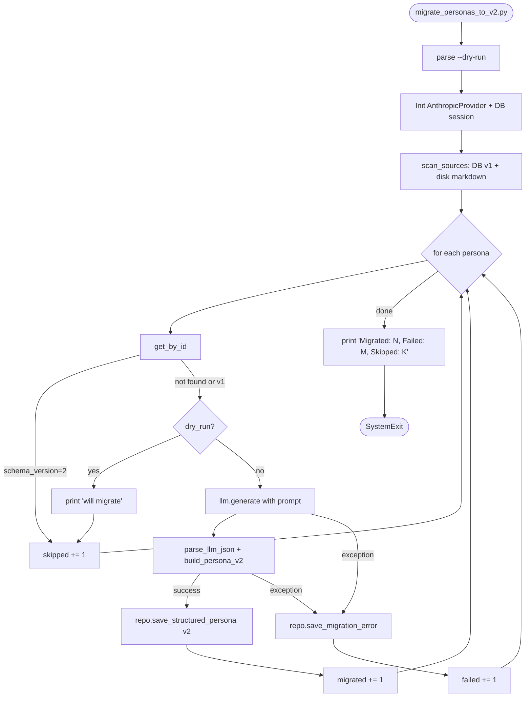

# Story 2.3 执行计划 — 旧 markdown persona 迁移到 5-layer

**Story**: Epic 2 / Story 2.3
**日期**: 2026-04-13
**Owner**: wanhua.gu
**依赖**: Story 2.2 (已完成 — 5-layer 领域模型 + DB 表 + 仓储)
**阻塞**: Story 2.4 (PersonaBuilderService — 可独立开发，但建议先迁移再上线)

> 此 plan 为 Flow B（改动跨 Infrastructure + Application 层 + 引入新 LLM prompt 工程）。实现后也落盘到 `docs/plans/2026-04-13-2.3-migrate-personas-to-v2.md`（同内容）。

## Context

Story 2.2 已经搭好 v2 结构化骨架：`stakeholder_personas` 表含 `structured_profile/evidence_citations/schema_version/legacy_content` 列，`SQLAlchemyStakeholderPersonaRepository` 支持 v2 upsert。但当前 5 个现有 persona (`data/personas/{boss,cfo,cto,pm,teamlead}.md`) 仍只存在磁盘上，DB 中没有一条 v2 记录。

Story 2.3 的目标：**一次性把磁盘 markdown + DB 中 schema_version=1 的 persona 迁移成 v2 结构化 JSON**，迁移后 `PersonaLoader` 走 DB 快路径，演练进入时不再扫磁盘。

### Why LLM 不是手写解析器

markdown 中的 `## 信息偏好 / 决策风格 / 期望与雷区 / 沟通策略 / 证据记录` 不是严格的 key-value — 每个 persona 的写法差异较大，正则/ast 解析会漏掉大量语义。LLM 可以处理语义重整（如把"追因型"映射到 `DecisionPattern.style`、把"证据记录"的每一条映射到 `Evidence`）。

这是本 Story 的外部系统复杂度来源：**设计一次稳定的 prompt + 定义 5-layer JSON schema + 容错解析**（Triage 第 6 问之所以"否"）。

---

## §0 Triage 分级

| # | 问题 | 答案 |
|---|------|------|
| 1 | 单一用户目标？ | YES（迁移 v1 → v2） |
| 2 | 单一业务模块？ | YES（stakeholder persona） |
| 3 | 不改 DB schema？ | YES（列都在 Story 2.2） |
| 4 | 不改公共 API？ | YES（纯离线脚本，零 HTTP） |
| 5 | 不改 domain 规则？ | YES（复用现有 dataclass） |
| 6 | 不涉及外部系统？ | **NO** — 新建 prompt + JSON schema 解析 + LLM 调用编排 |
| 7 | 不涉及权限/幂等？ | YES（schema_version check = 简单幂等） |
| 8 | 少量文件 ≤ 2 层？ | YES（scripts/ + 1 prompt + 测试） |

**→ Flow B**（1 个 NO，第 6 问）。未触发强制升级条件。

### Scope Challenge 四问

- **能不能只做一半？** 不能。AC 要求脚本同时处理磁盘 + DB 两类来源；只做磁盘扫描则 DB 中已有的 v1 记录不会升级，未来 Story 2.4 读到混合数据会歧义。
- **有没有更轻的替代方案？** 考虑过"手写 markdown → 5-layer 解析"，但 `## 决策风格 - 追因型：...` 这类自然语言 key 正则匹配脆弱。LLM 是更合适的工具。
- **能不能拆成多个 Story？** 不拆。AC6 汇总报告要求扫描 + 迁移 + 幂等 + 失败处理是一个闭环。
- **这次真正必须产出？** (1) `backend/scripts/migrate_personas_to_v2.py` CLI; (2) `backend/application/services/stakeholder/prompts/persona_v1_to_v2.md` prompt; (3) 1 个纯函数 LLM 响应解析器; (4) 1 个 persona markdown → v2 适配器 (PersonaLoader 已有 `_parse_file` 可复用); (5) 幂等 + 失败不阻塞 + --dry-run + 汇总报告 + 单元测试。

### 本次必须产出

- **Infrastructure**: `backend/scripts/migrate_personas_to_v2.py`（可执行 CLI）
- **Application prompt**: `backend/application/services/stakeholder/prompts/persona_v1_to_v2.md`（LLM 指令 + 5-layer JSON schema 定义 + few-shot 输出格式）
- **Application logic**: 迁移核心函数（纯函数，无 I/O 耦合）放进 `backend/application/services/stakeholder/persona_migrator.py`，脚本 import 调用
- **Tests**: `backend/tests/application/test_persona_migrator.py`（mock LLM，覆盖所有 AC）

---

## §1 目标

- 一条命令 `python backend/scripts/migrate_personas_to_v2.py` 即可把 `data/personas/*.md` 和 DB 中 schema_version=1 的 persona 迁移成 v2
- 幂等：重跑不重复迁移，schema_version=2 的跳过
- 失败隔离：某条 persona LLM 解析失败不影响其他；失败原因写入 `structured_profile._error`
- `--dry-run` 只打印变更摘要，不写 DB
- stdout 含 "Migrated: N, Failed: M, Skipped: K" 汇总行
- 迁移后 DB 有 5 条 schema_version=2 记录（boss/cfo/cto/pm/teamlead），每条 `legacy_content == 原 markdown`

---

## §2 范围

### 做

- 新建 CLI 脚本 + prompt 文件 + pure-function migrator 模块
- 扫描来源：先扫 DB（schema_version=1） + 扫磁盘 `data/personas/*.md`，以 persona_id 合并去重（DB 优先，磁盘补充 DB 中没有的）
- LLM 提示词设计：输入 markdown 全文，输出 `{"hard_rules": [...], "identity": {...}, "expression": {...}, "decision": {...}, "interpersonal": {...}, "evidence_citations": [...]}`
- Evidence 层级约束：LLM 必须给每条 `evidence_citations.layer ∈ {hard_rules/identity/expression/decision/interpersonal}`
- 响应解析：严格 JSON + 字段校验失败 → 记为迁移失败（不写入），保留 schema_version=1，`structured_profile._error` 写入异常摘要
- `--dry-run`: 执行到 LLM 调用前打印"将迁移 persona_id=X"，不写 DB 且不调 LLM（节省成本）
- 汇总报告：末尾 `print("Migrated: N, Failed: M, Skipped: K")`

### 不做（明确 Not-in-scope）

- 不动 `data/personas/*.md` 源文件（保留为 v1 fallback）
- 不加 CLI args 除了 `--dry-run`（如 `--persona-id xxx`；MVP 简单处理）
- 不做并发 LLM 调用（顺序处理，5 条 persona 可接受 5×<30s = <2.5 分钟）
- 不加 Celery/后台任务（纯一次性脚本）
- 不处理"LLM 返回有效 JSON 但字段缺失"的部分字段填充 — 一律判失败，人工补录
- 不动 `PersonaLoader`（Story 2.2 已支持 v2 DB 路径）
- 不做回滚脚本（失败项保留 schema_version=1 即自然回退路径）

---

## §3 影响范围

| 层 | 变更 | 新增/修改 |
|---|---|---|
| `backend/scripts/migrate_personas_to_v2.py` | **新增** | CLI entrypoint (argparse + asyncio + DB session) |
| `backend/application/services/stakeholder/persona_migrator.py` | **新增** | 纯函数：`parse_llm_response`, `build_persona_v2`, `migrate_one(persona_id, markdown, llm, *, dry_run)` |
| `backend/application/services/stakeholder/prompts/__init__.py` | **新增** | 空包，标识 prompts 目录 |
| `backend/application/services/stakeholder/prompts/persona_v1_to_v2.md` | **新增** | LLM 系统提示词 + 5-layer JSON schema + 示例 |
| `backend/tests/application/test_persona_migrator.py` | **新增** | pure-function 单测 + mock LLM + 幂等/失败/dry-run |
| `backend/application/services/stakeholder/README.md` | 修改 | 登记新模块 |
| `backend/scripts/README.md` | 修改 | 登记新脚本 |

### 不会修改

- Domain 层 (dataclass 已齐全)
- DB schema / migration (Story 2.2 已建)
- `SQLAlchemyStakeholderPersonaRepository` (现有 API 足够)
- `PersonaLoader` (Story 2.2 已支持 v2)
- `data/personas/*.md` 源文件
- 任何 API 路由 / 前端

---

## §4 风险

| 风险 | 概率 | 影响 | 应对 |
|------|------|------|------|
| LLM 输出 JSON 格式不稳定（缺字段/多余字段/markdown 包裹） | 中 | 中 | prompt 要求仅输出 JSON + 代码中 strip \`\`\`json 包装 + `json.loads` 失败视为迁移失败 |
| LLM 响应太长被截断 | 低 | 中 | max_tokens 设 4096，persona markdown < 5KB 通常够；若失败记录并人工处理 |
| Evidence.layer 非法值 | 低 | 低 | prompt 强约束 + `Evidence(**data)` 的 `__post_init__` 校验 → 抛 DomainValidationException 捕获为迁移失败 |
| 脚本中途 Ctrl+C 导致部分 commit 部分未 commit | 中 | 低 | 每条 persona 独立 session + commit，retry 时幂等 skip 已完成的 |
| --dry-run 意外跳过 LLM 调用导致用户误以为"预览"真实 LLM 结果 | 低 | 低 | --dry-run 明确打印 "will call LLM for ..." 并 skip，README 说明 |
| 多次 LLM 重跑成本累积 | 低 | 低 | MVP 5 条 persona × 2-3 次迭代 ≈ 15 次调用 × $0.1 ≈ $1.5，可接受 |

### Failure modes

| 场景 | 期望行为 |
|------|----------|
| LLM API 不可达 / 超时 | 该 persona 记失败，继续下一条 |
| LLM 返回非 JSON | 记失败 + 错误写 `structured_profile._error` |
| LLM JSON 字段缺失（如少 `identity`） | 记失败 |
| LLM 返回 layer 非法值 | 由 dataclass `__post_init__` 抛异常 → 记失败 |
| 已有 schema_version=2 记录 | skip，不调 LLM |
| 磁盘 markdown 文件 parse 失败（frontmatter 损坏） | skip + warning，不算失败 |
| --dry-run 模式 | 只打印，不调 LLM，不写 DB |

### 回滚

若迁移有问题：`UPDATE stakeholder_personas SET schema_version=1, structured_profile=NULL, evidence_citations=NULL WHERE id IN (...)` → PersonaLoader 自动回退到 markdown 路径（legacy_content 保留以供审计）。

---

## §5 验收标准 (from Story)

1. `backend/scripts/migrate_personas_to_v2.py` 存在，幂等（schema_version=2 跳过）
2. 扫描 `data/personas/*.md` + DB schema_version=1 persona，调 LLM 解析 5-layer JSON；5 个预置 persona 全部迁移成功（mock LLM）
3. 原 markdown 保留在 `legacy_content`，`full_content` 保持不变
4. 迁移失败不阻塞其他，失败项保持 schema_version=1，错误写入 `structured_profile._error`（不新增列）
5. `--dry-run` 只打印，不写 DB
6. 末尾 stdout `Migrated: N, Failed: M, Skipped: K`

---

## §7 当前现状 (What already exists)

**可复用（高优先级）**：
- `SQLAlchemyStakeholderPersonaRepository.save_structured_persona` (`backend/infrastructure/repositories/stakeholder_persona_repository.py:124`) — v2 upsert，只需 Persona 实例
- `SQLAlchemyStakeholderPersonaRepository.list_all(schema_version=1)` — 扫 DB v1 记录
- `PersonaLoader._parse_file` (`backend/application/services/stakeholder/persona_loader.py:122`) — markdown → v1 Persona 含 frontmatter 解析；迁移时要用它的 frontmatter 解析逻辑拿 `name/role/avatar_color`
- `AnthropicProvider` + `application.ports.llm.LLMPort` + `LLMMessage` — 现成的 LLM 调用抽象
- `infrastructure.database.AsyncSessionLocal` — async session 工厂
- `core.config.settings.stakeholder.anthropic_api_key` + `.model` — LLM 凭据
- `domain.stakeholder.persona_entity` 中全部 dataclass + `Evidence.__post_init__` 校验

**不可复用**：
- 现有 `AnthropicProvider` 在 FastAPI lifespan 中初始化，脚本不走 lifespan — 脚本需自建 AnthropicProvider 实例
- `PersonaLoader` 的缓存/并发代码不适用一次性脚本

**现有脚本模式** (`backend/scripts/validate_po.py`)：同步 `main() → int` + `if __name__ == "__main__": raise SystemExit(main())`。本脚本需 async（DB + LLM 都是 async），用 `asyncio.run(main())` 适配。

---

## §8 方案概述

### 两层拆分（利于测试）

1. **Pure-function layer** (`persona_migrator.py`)：
   - `def parse_llm_json(raw: str) -> dict` — 剥 markdown 代码围栏 + json.loads + 基础结构校验
   - `def build_persona_v2(v1: Persona, llm_data: dict) -> Persona` — 组装 v2 Persona (复用 v1 的 id/name/role/voice_*，结构化字段来自 llm_data)
   - `async def migrate_one(v1_persona: Persona, llm: LLMPort, prompt: str, *, dry_run: bool) -> MigrationOutcome` — 调 LLM + 解析 + 构建 v2；dry_run 直接 return Skipped
   - `MigrationOutcome` = `Literal["migrated", "failed", "skipped"]` + optional error

2. **Script/orchestration layer** (`migrate_personas_to_v2.py`)：
   - argparse `--dry-run`
   - 自建 AnthropicProvider
   - 扫描两源（DB + 磁盘）合并去重
   - 对每个 v1 persona 调 `migrate_one`
   - 成功 → `repo.save_structured_persona(v2) + session.commit()`
   - 失败 → 查现有记录，把 `structured_profile = {"_error": "..."}` 写回（保持 schema_version=1）
   - 汇总打印

### 数据源合并逻辑

```
db_v1 = await repo.list_all(schema_version=1)  # DB 里 schema_version=1 的
md_personas = scan data/personas/*.md via PersonaLoader._parse_file
# 合并: DB 优先 (如果同 id 已在 DB 则以 DB 为准)
merged_by_id: dict[str, Persona] = {p.id: p for p in md_personas}
for p in db_v1:
    merged_by_id[p.id] = p  # DB 覆盖磁盘
# schema_version=2 的在 DB 中直接 skip (不进 merged)
```

### 幂等 (AC1)

在脚本入口处：
```python
existing = await repo.get_by_id(persona_id)
if existing and existing.schema_version == 2:
    skipped += 1
    continue
```

### 失败处理 (AC4)

```python
try:
    v2 = await migrate_one(v1, llm, prompt, dry_run=args.dry_run)
except Exception as exc:
    # 写 _error 到 structured_profile
    existing = await repo.get_by_id(v1.id)
    if existing is None:
        # 磁盘来的 persona，DB 没记录 → 先建 v1 record 保留 markdown + _error
        stub = Persona(id=v1.id, name=v1.name, role=v1.role,
                       full_content=v1.full_content, legacy_content=v1.full_content,
                       schema_version=1)
        stub_saved = await repo.save_structured_persona(stub)  # 注意：此方法 serialize 时 schema_version<2 → structured=None
        # 需要单独写 _error → 直接操作 model 或加新 repo 方法？
```

**关键决策**：`_serialize_structured_profile` 当前在 `schema_version < 2` 时 return None，会把 error 洗掉。**选项**：

- (A) 放宽 serialization：对 v1 + _error 特殊处理 — 会污染 repo 语义
- (B) 新增 `repo.save_migration_error(persona_id, error_msg)` 方法 — 干净但多一个方法
- (C) 脚本直接通过 session 操作 ORM model（违反分层）— 不可
- (D) 为失败 persona 仍写 `schema_version=1` 但把 `structured_profile = {"_error": "..."}` 通过扩展 repo

**采用 (B)**：在 `SQLAlchemyStakeholderPersonaRepository` 新增 `async def save_migration_error(persona_id: str, error: str, legacy_markdown: str | None = None) -> None`。此方法允许把 `structured_profile = {"_error": ...}` + `schema_version=1` 写回，不违反 v1/v2 语义（_error 是 metadata 而非 v2 结构）。

> ⚠️ 这就突破了 Story 2.2 现有接口，轻微扩展。已通过强制升级条件自检：不改表结构、不改公共 API、不改 domain；只是加仓储方法 — Flow B 允许范围内。

### --dry-run (AC5)

`--dry-run` 在 orchestration 层拦截：
- 不调 LLM、不调 `save_structured_persona`
- 打印 `[DRY-RUN] will migrate: persona_id={id}, markdown={len} bytes`
- 汇总时 `Migrated: 0, Failed: 0, Skipped: {count}`

---

## §9 核心流程（Mermaid）



---

## §10 关键实现细节

### Prompt 文件结构 (`persona_v1_to_v2.md`)

```markdown
You are a persona structuring expert. Convert v1 markdown persona into v2 5-layer JSON.

## Input
A full markdown persona document describing a real person (stakeholder).

## Output
ONLY valid JSON matching this schema. NO markdown fences, NO prose.

{
  "hard_rules": [{"statement": "...", "severity": "low|medium|high|critical"}],
  "identity": {"background": "...", "core_values": [...], "hidden_agenda": "..."|null},
  "expression": {"tone": "...", "catchphrases": [...], "interruption_tendency": "low|medium|high"},
  "decision": {"style": "...", "risk_tolerance": "low|medium|high", "typical_questions": [...]},
  "interpersonal": {"authority_mode": "...", "triggers": [...], "emotion_states": [...]},
  "evidence_citations": [
    {"claim": "...", "citations": ["..."], "confidence": 0.0-1.0,
     "source_material_id": "{persona_id}-markdown", "layer": "hard_rules|identity|expression|decision|interpersonal"}
  ]
}

## Rules
1. Every evidence_citations.layer MUST be one of: hard_rules, identity, expression, decision, interpersonal
2. Extract hard_rules from "## 期望与雷区" (雷区 = red lines)
3. Extract identity from "## 信息偏好" + "## 期望与雷区" (核心价值/激励)
4. Extract expression from "## 沟通策略" + 原话样本
5. Extract decision from "## 决策风格"
6. Extract interpersonal from overall tone + 证据记录
7. Each evidence claim MUST reference actual text from the markdown (citations = 原文引用)
8. confidence: 高=0.9, 中=0.7, 低=0.5 (依据 markdown 中的 confidence 标注)
9. Ensure valid JSON, no trailing commas, no comments
```

### Idempotency 语义

- schema_version=2 的 persona：completely skip，不调 LLM（节省成本）
- schema_version=1 with `structured_profile._error`：视为上次迁移失败，**重试**（不 skip）
- 新建脚本重跑：失败的会自动重试，成功的会 skip

### 错误信息结构

写入 DB 的失败 metadata：
```json
{"_error": "LLMParseError: Expecting value: line 1 column 1", "_attempted_at": "2026-04-13T..."}
```

### 并发 / 事务

- 每条 persona 独立 session + commit（不在长事务里）
- 单次脚本运行期间重试失败的不必要复杂；失败了下次人工或定期重跑

---

## §11 执行步骤

每步 = 一个 task，完成后 commit。

### Step 1: 落盘 plan 到 `docs/plans/`
- 把本 plan 文件同步到 `docs/plans/2026-04-13-2.3-migrate-personas-to-v2.md`
- Commit: `docs(story-2.3): add execution plan`

### Step 2: TDD Red — pure function tests
- 新建 `backend/tests/application/test_persona_migrator.py`
- 覆盖：
  - `test_parse_llm_json_strips_code_fence` (e.g. `\`\`\`json\n{...}\n\`\`\``)
  - `test_parse_llm_json_rejects_non_json`
  - `test_build_persona_v2_preserves_v1_fields` (id/name/role/voice_*)
  - `test_build_persona_v2_sets_schema_version_2_and_legacy_content`
  - `test_build_persona_v2_rejects_invalid_layer` (Evidence layer 非法)
- 运行：`pytest tests/application/test_persona_migrator.py -v` → 全失败（ImportError）
- Commit: `test(story-2.3): red tests for persona_migrator pure functions`

### Step 3: Green — 实现 `persona_migrator.py`
- 新建 `backend/application/services/stakeholder/persona_migrator.py`
  - `parse_llm_json(raw: str) -> dict`
  - `build_persona_v2(v1: Persona, llm_data: dict, markdown: str) -> Persona`
  - `class MigrationError(Exception)`
- 运行测试 → 全绿
- Commit: `feat(story-2.3): persona_migrator pure functions (AC2,AC3)`

### Step 4: TDD Red — migrate_one orchestration test
- 新增 `test_persona_migrator.py`：
  - `test_migrate_one_dry_run_returns_skipped_without_calling_llm`
  - `test_migrate_one_success_returns_v2_persona` (mock LLM 返回合法 JSON)
  - `test_migrate_one_llm_exception_raises_MigrationError`
  - `test_migrate_one_invalid_json_raises_MigrationError`
  - `test_migrate_one_missing_fields_raises_MigrationError`
- 运行 → 红
- Commit: `test(story-2.3): red tests for migrate_one orchestration`

### Step 5: Green — 实现 `migrate_one`
- 在 `persona_migrator.py` 中实现 `async def migrate_one(...)` + 加载 prompt 文件（用 `importlib.resources` 或相对路径 `Path(__file__).parent / "prompts" / "persona_v1_to_v2.md"`）
- 新增 `backend/application/services/stakeholder/prompts/__init__.py`（空包）
- 新增 `backend/application/services/stakeholder/prompts/persona_v1_to_v2.md`
- 测试全绿
- Commit: `feat(story-2.3): migrate_one + persona_v1_to_v2 prompt (AC2)`

### Step 6: Extend repository — 失败 metadata 写回
- 在 `domain.stakeholder.repository.StakeholderPersonaRepository` 加抽象 `async def save_migration_error(persona_id: str, error: str, *, legacy_markdown: str | None = None, name: str = "", role: str = "") -> None`
- 在 `SQLAlchemyStakeholderPersonaRepository` 实现（upsert：如记录不存在先 insert v1 stub；已存在则仅更新 `structured_profile._error` + legacy_content）
- 新增测试 `test_save_migration_error_upsert_preserves_schema_version_1`
- Commit: `feat(story-2.3): save_migration_error on repository (AC4)`

### Step 7: CLI script + 集成测试
- 新建 `backend/scripts/migrate_personas_to_v2.py`
  - argparse `--dry-run`
  - async main：init AnthropicProvider + session → scan_sources → for each persona migrate_one → print report
  - fallback：缺 ANTHROPIC_API_KEY 时立即报错退出
- 新增测试 `test_persona_migrator.py`：
  - `test_script_idempotent_skips_v2` (mock repo)
  - `test_script_report_format_matches_spec` (捕获 stdout 含 `Migrated: N, Failed: M, Skipped: K`)
  - `test_script_dry_run_does_not_call_llm_or_save`
  - `test_script_one_failure_does_not_block_others` (mock LLM 第 2 条抛异常)
- Commit: `feat(story-2.3): migrate_personas_to_v2 CLI script (AC1,AC5,AC6)`

### Step 8: Integration smoke test (optional live)
- 若 `ANTHROPIC_API_KEY` 可用，手动跑 `--dry-run` 确认扫描逻辑正确
- 真实跑一次迁移 5 条 persona，`SELECT id, schema_version, length(legacy_content) FROM stakeholder_personas` 验证
- 若无 key：跳过此步，用 mock 测试已覆盖

### Step 9: 维护 README + 头注释
- 更新 `backend/scripts/README.md` 登记新脚本
- 更新 `backend/application/services/stakeholder/README.md` 登记 persona_migrator + prompts/
- 每个新文件加 4 行头注释（input/output/owner/pos）
- Commit: `docs(story-2.3): update READMEs + file headers`

---

## §12 AC → 测试映射表

| # | AC 原文 | 验证方式 | 执行引用 | 预期结果 | 类型 |
|---|---------|---------|----------|----------|------|
| 1 | `migrate_personas_to_v2.py` 存在，幂等（schema_version=2 跳过） | pytest mock repo | `tests/application/test_persona_migrator.py::test_script_idempotent_skips_v2` | skipped_count == 已 v2 的条数；LLM 未被调 | unit |
| 2 | 扫磁盘 + DB schema_version=1，调 LLM 解析 5-layer JSON；5 个预置 persona 全部迁移成功 | pytest mock LLM (5 个返回合法 JSON) | `tests/application/test_persona_migrator.py::test_script_migrates_five_personas` | migrated_count == 5; DB 中 5 条 schema_version=2 | unit+integration |
| 3 | 原 markdown 保留 legacy_content，full_content 不变 | pytest save后get | `tests/application/test_persona_migrator.py::test_build_persona_v2_preserves_markdown_in_legacy_content` | 迁移后 persona.legacy_content == 原 markdown; full_content 不变 | unit |
| 4 | 失败不阻塞其他，失败项 schema_version=1 + `structured_profile._error` | pytest mock LLM 第 2 条抛异常 | `tests/application/test_persona_migrator.py::test_script_one_failure_does_not_block_others` | migrated=4, failed=1; 失败项 schema_version=1 且 structured_profile._error 存在 | unit |
| 5 | `--dry-run` 不写 DB | pytest argparse+mock | `tests/application/test_persona_migrator.py::test_script_dry_run_does_not_call_llm_or_save` | LLM.generate 未被调；repo.save_structured_persona 未被调；stdout 含 "DRY-RUN" | unit |
| 6 | 末尾 stdout `Migrated: N, Failed: M, Skipped: K` | pytest capsys | `tests/application/test_persona_migrator.py::test_script_report_format_matches_spec` | stdout 正则匹配 `Migrated: \d+, Failed: \d+, Skipped: \d+` | unit |

**完整性门控**：
- total_ac = 6（epic 中 Story 2.3 checkbox 数）
- mapped_ac = 6
- ✅ 100% 覆盖

---

## §13 关键文件路径

| 文件 | 作用 |
|------|------|
| `backend/scripts/migrate_personas_to_v2.py` | CLI entrypoint |
| `backend/application/services/stakeholder/persona_migrator.py` | pure function + orchestration |
| `backend/application/services/stakeholder/prompts/persona_v1_to_v2.md` | LLM 提示词 |
| `backend/application/services/stakeholder/prompts/__init__.py` | 空包 |
| `backend/tests/application/test_persona_migrator.py` | 所有测试 |
| `backend/application/services/stakeholder/README.md` | 更新模块索引 |
| `backend/scripts/README.md` | 更新脚本索引 |
| `docs/plans/2026-04-13-2.3-migrate-personas-to-v2.md` | 本 plan 落盘 |

## §14 验收 / 回归测试命令

```bash
# 单元 + 集成测试（全部绿）
cd backend && uv run pytest tests/application/test_persona_migrator.py -v

# 无回归：原有 persona loader 测试
cd backend && uv run pytest tests/application/test_persona_loader_v2.py tests/test_persona_loader.py -v

# 全量回归（快速）
cd backend && uv run pytest -q

# --dry-run 手动验证（不需要 LLM key）
cd backend && uv run python scripts/migrate_personas_to_v2.py --dry-run

# （可选）真实迁移（需 STAKEHOLDER__ANTHROPIC_API_KEY）
cd backend && uv run python scripts/migrate_personas_to_v2.py
```

### 回归风险判断

无跨层改动到 API / domain / 现有 service。主要风险在新增的 `save_migration_error` repo 方法 — 已通过独立测试覆盖。
